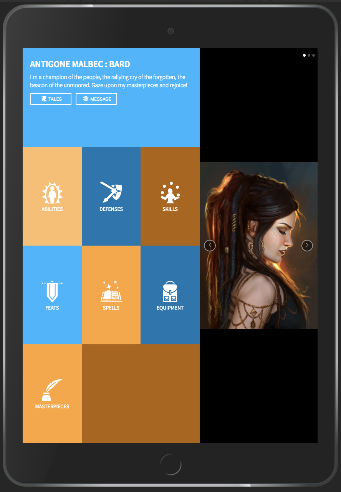

Static Comp Challenge 1 - Project Overview
==========================================

In the course of my studies at Turing, I was tasked with recreating the following composition, and making my own version responsive on multiple platforms.

### The Original Composition:

To stretch my creativity muscles, I made a simple character-sheet profile page for a revolutionary Pathfinder Bard named Antigone Malbec. The character portrait was sourced from here: https://www.artstation.com/artwork/8NJgq . The colors were chosen using the online Adobe color wheel, set to the "complementary" palet selector: https://color.adobe.com/create/color-wheel/ . The icons were sourced from https://game-icons.net/ and https://www.flaticon.com/ .

### My Version on Desktop:

### My Version on Tablet:

### My Version on Mobile:

